# CPET Mahdiyya Course


`view the homepage`
http://cpet.dhiu.in/


## Environment Variables

To run this project, you will need to add the following environment variables to your .env file ....

`MONGO_URI`


#### run this commands after clone this project

`server`

```bash
  npm install
  npm start
```

`client`

```bash
  cd client
  npm install
  npm start
```


`you can test account using this credentials`

  email (admin) : user01
  password : 1234

  email (super admin) : superadmin
  password : 1234


# screenshots

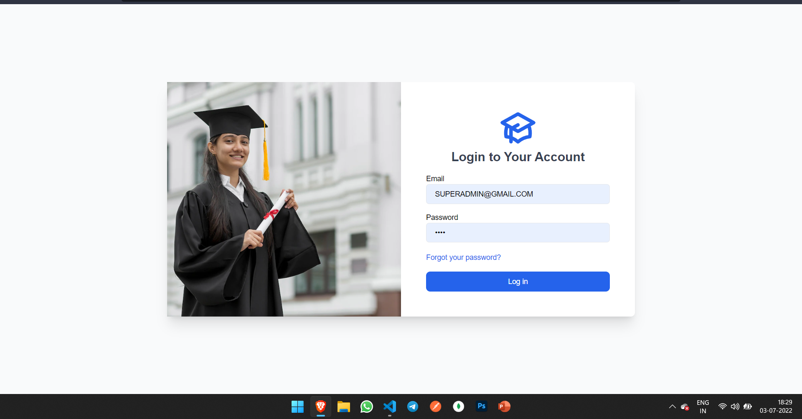
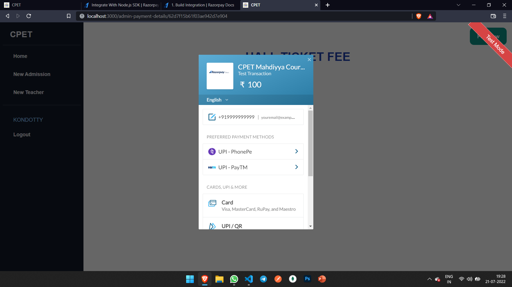
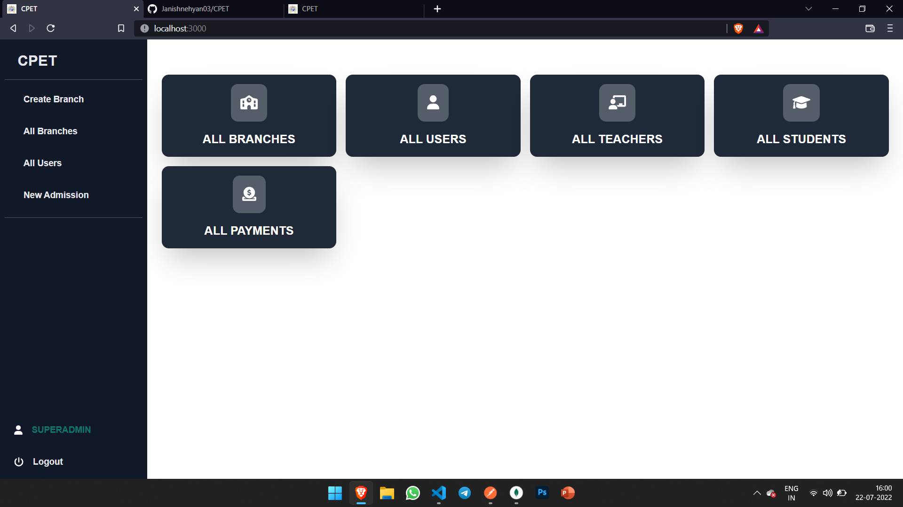
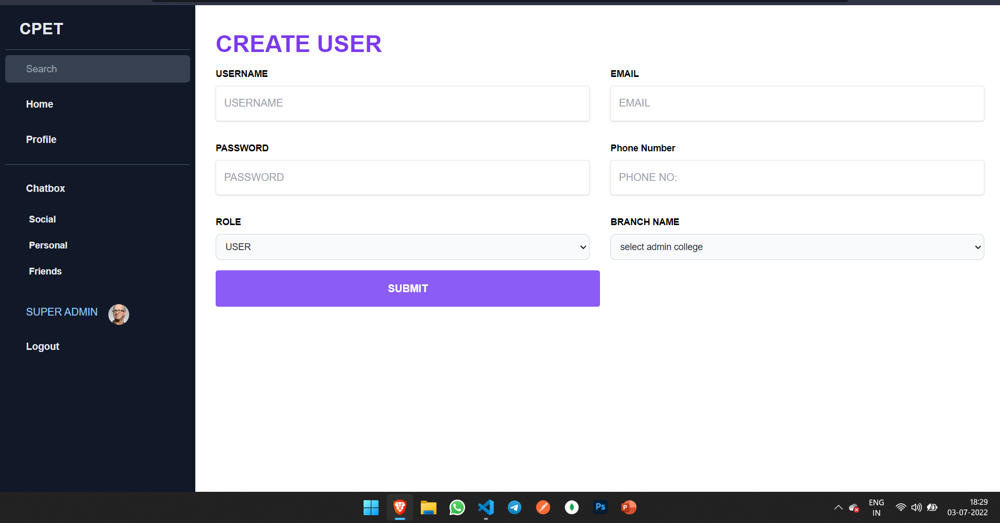
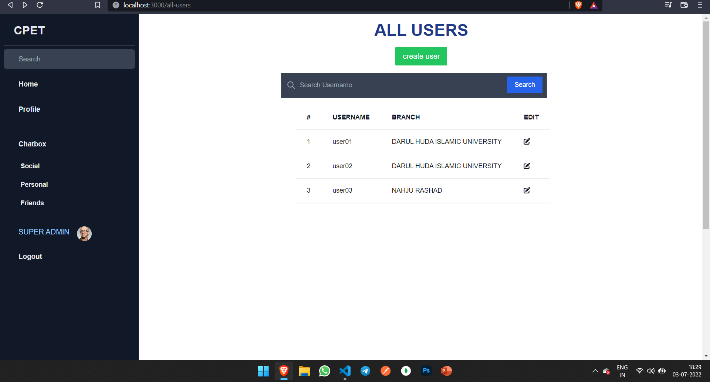
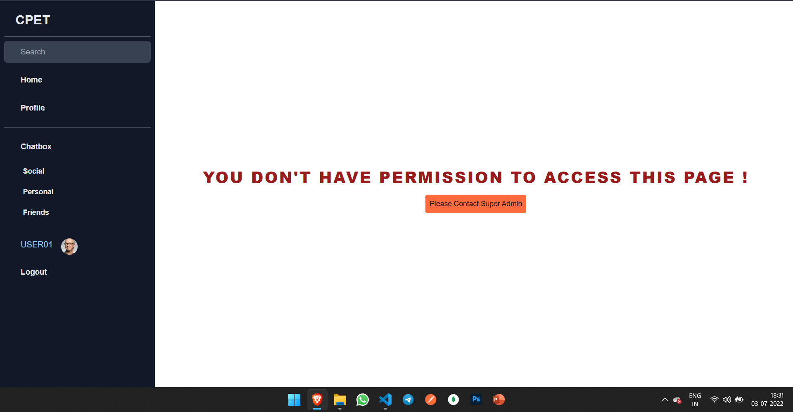
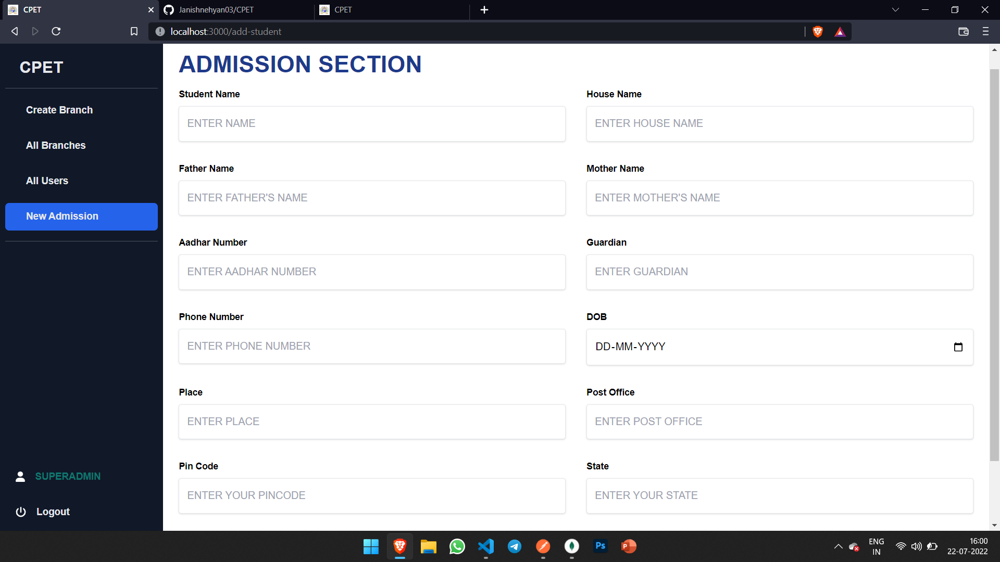
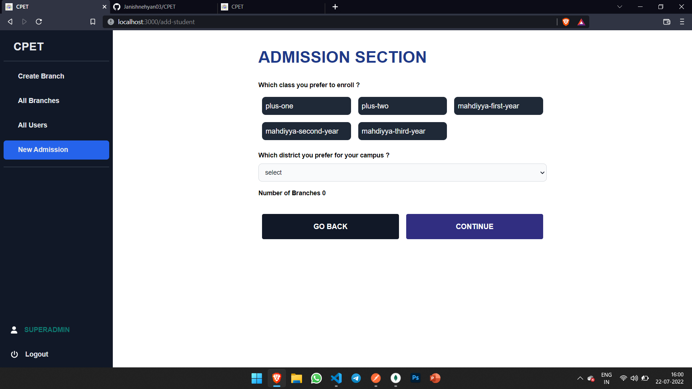
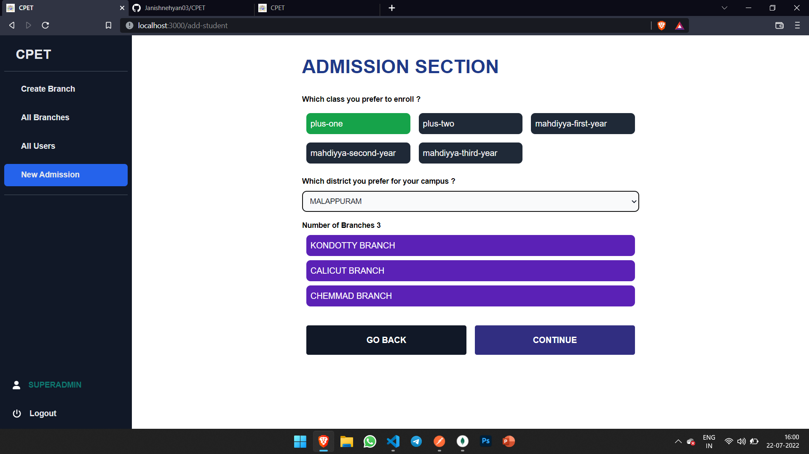
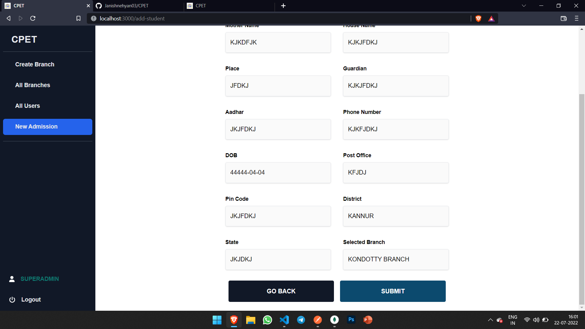
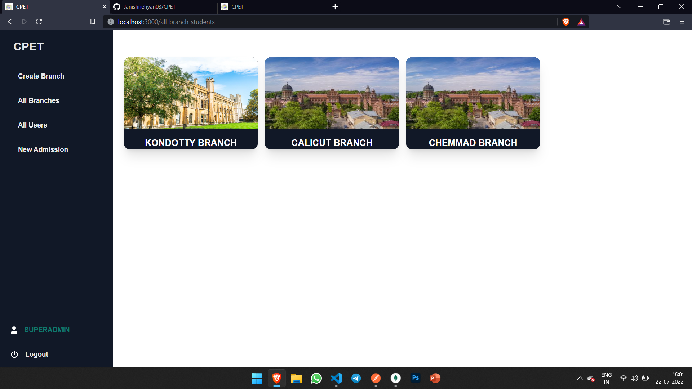
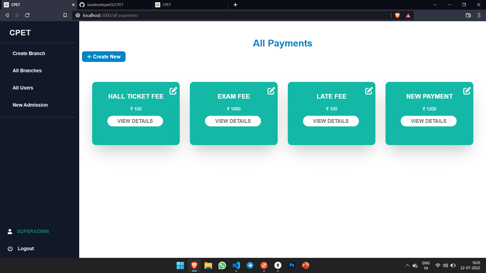
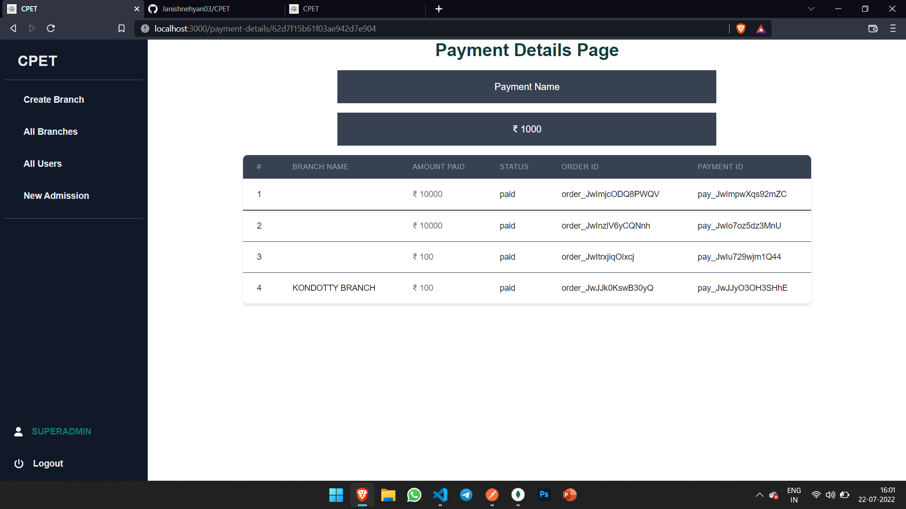